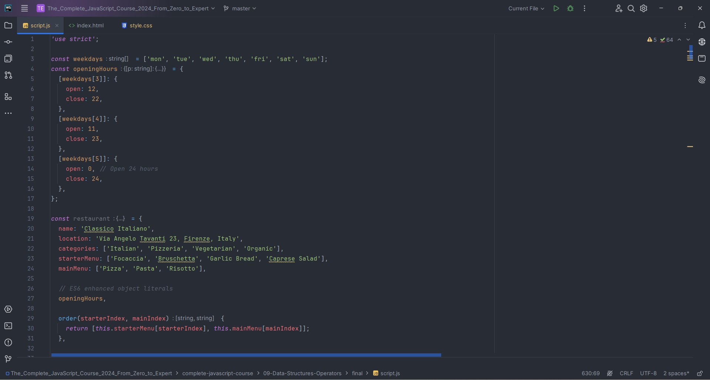
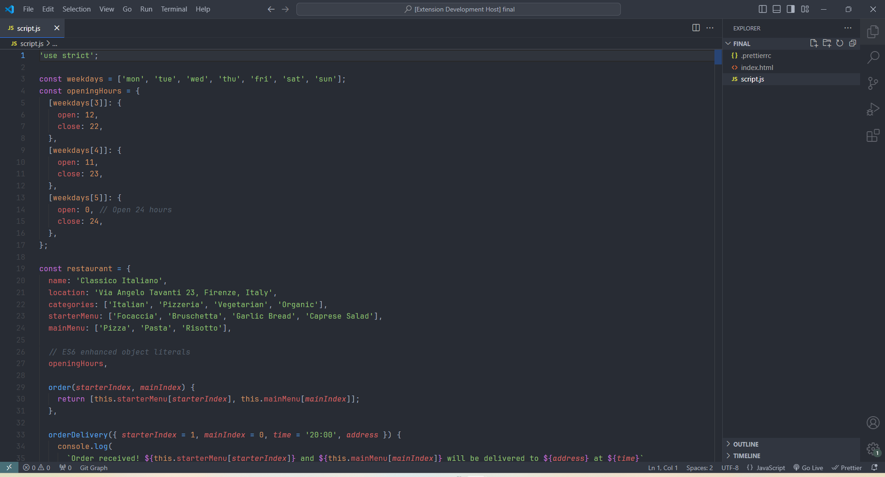
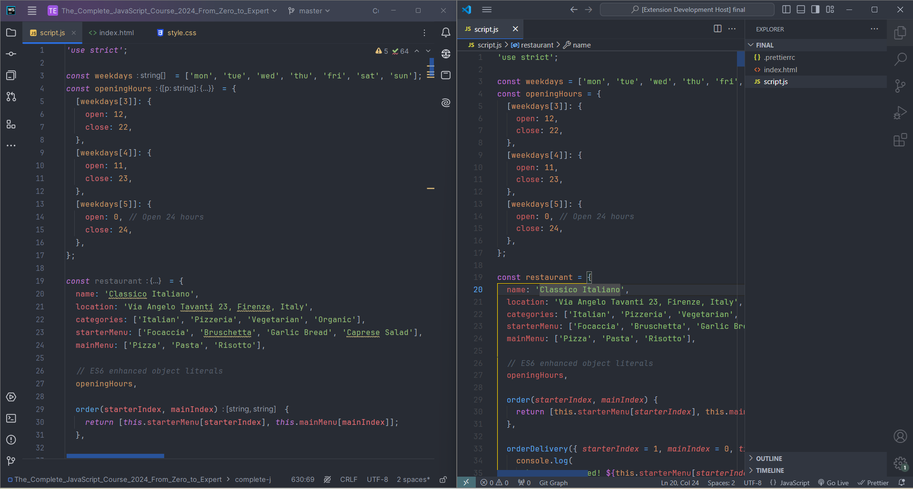

# WebStorm Theme

This theme is a look-alike of JetBrains WebStorm IDE. I wanted the same look as WebStorm IDE but for VS Code.

## Theme View

This look is what this theme aimed to replicate

This is the created theme

This is both the themes in a side by side comparison.

## Links

I have used the following to create this theme:

- [JetBrains WebStorm](https://www.jetbrains.com/webstorm/download/#section=windows)
- [themes.vscode.one](https://themes.vscode.one/)
- [yo-code-generator](https://www.npmjs.com/package/generator-code)

## Author

This theme was created by **Taizun Jafri** :

- GitHub - [Taizun Jafri](https://github.com/taizun-jj202)
- Email - [jafri.taizun.s@gmail.com](jafri.taizun.s@gmail.com)
- Twitter - [@JafriTaizun](https://www.twitter.com/JafriTaizun)

### Note :

From the three themes inside the themes folder, chose [this](./themes/web-storm-look-alike-theme-color-theme.json) JSON file.
The other two files were created as an experiment and you could use them as standalone themes. But choose [this](./themes/web-storm-look-alike-theme-color-theme.json) theme only if you want the above results.
