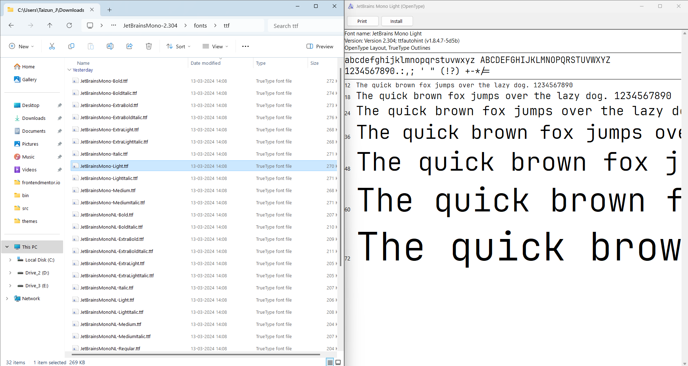
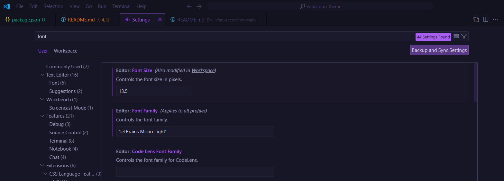

# WebStorm Theme

This theme is a look-alike of JetBrains WebStorm IDE. I wanted the same look as WebStorm IDE but for VS Code.

> Note: I am using the `JetBrains Mono Light` fonts for this.

# Table of Contents

- [Theme View](#theme-view)
  - [Fonts](#font-instructions)
- [Links](#links)
- [Author](#author)
- [Note](#note)

## Theme View

This look is what this theme aimed to replicate

This is the created theme

This is both the themes in a side by side comparison.

## Links

I have used the following to create this theme:

- [JetBrains WebStorm](https://www.jetbrains.com/webstorm/download/#section=windows)
- [themes.vscode.one](https://themes.vscode.one/)
- [yo-code-generator](https://www.npmjs.com/package/generator-code)

## Font Instructions

This theme will not look exactly like WebStorm unless we also change the fonts. Follow these steps to install the fonts easily.

1. Download the JetBrains Mono fonts from JetBrains website or from [here](https://www.jetbrains.com/lp/mono/)
2. After downloading the fonts, unzip the folder
3. Install only the `JetBrains Mono Light` font only
   - 
4. Now in VS Code, Open Settings and in the search for fonts.
5. Now change the font to `JetBrains Mono Light` inside single quotes, otherwise the font change will not work
   - 

## Author

This theme was created by **Taizun Jafri** :

- GitHub - [Taizun Jafri](https://github.com/taizun-jj202)
- Email - [jafri.taizun.s@gmail.com](jafri.taizun.s@gmail.com)
- Twitter - [@JafriTaizun](https://www.twitter.com/JafriTaizun)

### Note :

From the three themes inside the themes folder, chose [this](./themes/web-storm-look-alike-theme-color-theme.json) JSON file.
The other two files were created as an experiment and you could use them as standalone themes. But choose [this](./themes/web-storm-look-alike-theme-color-theme.json) theme only if you want the above results.
